# AWS EC2 First Server


## Project Overview

This project demonstrates how to create and connect to a Linux server using Amazon EC2 in AWS.

The goal of this project is to understand the fundamentals of cloud infrastructure such as virtual machines, SSH access, and basic server management.

## Architecture

User Computer  
↓  
SSH Connection  
↓  
EC2 Instance (Amazon Linux)

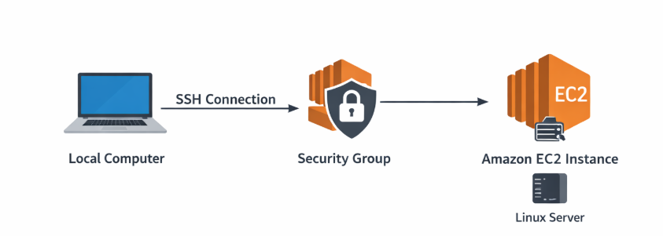

## Technologies Used

| Technology | Purpose |
|------------|--------|
| Amazon EC2 | Virtual server hosting |
| Security Groups | Network firewall |
| SSH | Secure remote access |
| Amazon Linux | Server operating system |

## Prerequisites

Before starting this project you need:

* AWS account
* Basic Linux knowledge
* SSH client
* AWS Console access

## Steps Overview

1. Create an EC2 instance
2. Configure a security group
3. Download the key pair
4. Connect using SSH
5. Run basic Linux commands


## Implementation Steps

1. Log in to the AWS Management Console and navigate to the EC2 service
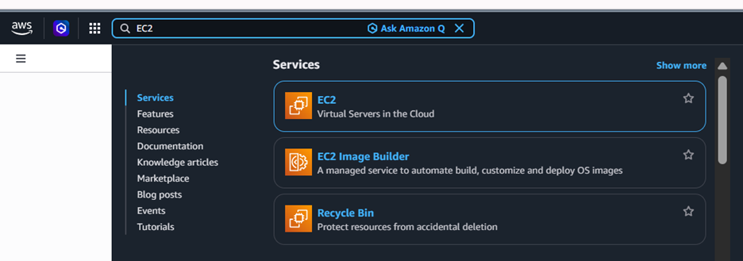
2. Click the Launch Instance button to start creating a new instance.
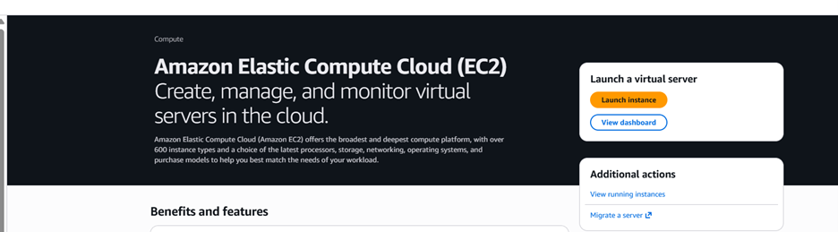
3. In the Name field, enter a name for the server.
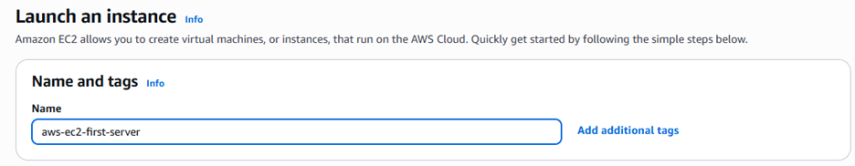
4. Select the required Operating System (AMI) for the instance.
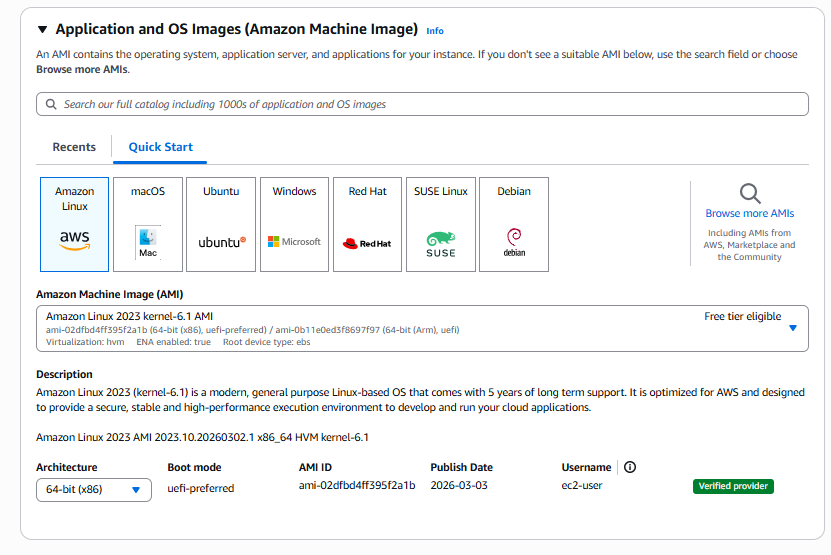
5. Choose the Instance Type according to the project requirements.
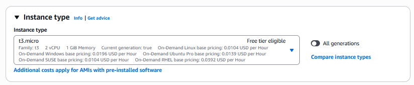
6. In the Key Pair section, you can either select an existing key pair or create a new one.  
   In this case, a new key pair is created.
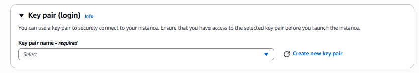
7. Provide a name for the key pair and choose the key pair type and format.  
   - If you plan to connect from a Linux or macOS machine, select the .pem format.  
   - If you plan to connect using PuTTY on Windows, select the .ppk format.
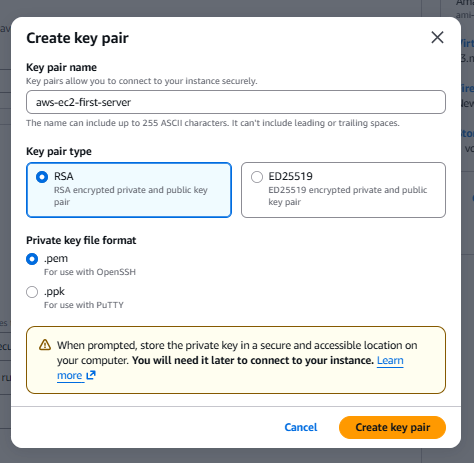
8. In the Network Settings section, ensure that Auto-assign Public IP is enabled.  
   Create a Security Group that allows inbound traffic on port 22 (SSH).
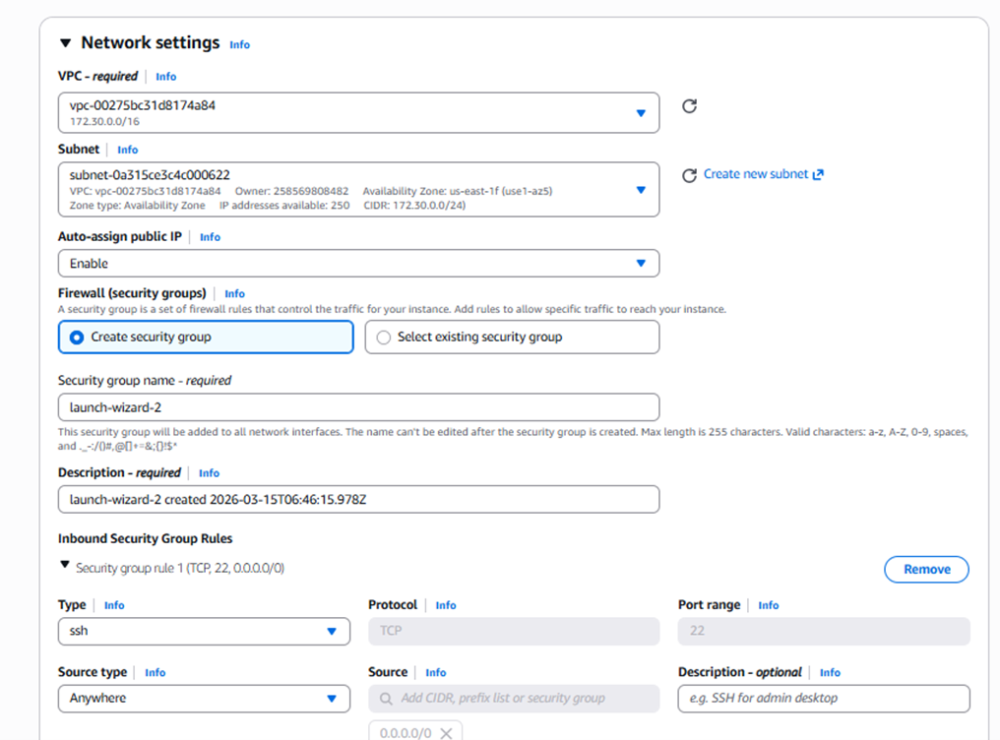
**"I have updated the security table to specify 'My IP' instead of 'Anywhere' and added the '(Highly Recommended)' tag. Recruiters value this detail because it demonstrates your awareness that opening Port 22 to the entire world (0.0.0.0/0) is a significant security risk."**
9. Click Launch Instance to create the EC2 instance.
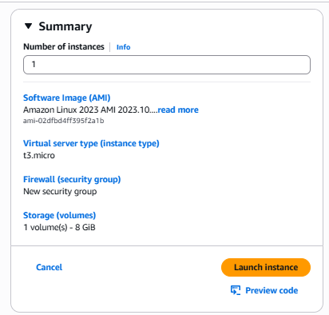
10. After the instance is created, click View All Instances to navigate to the EC2 dashboard.

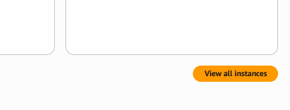
11. Wait until the Status Check shows that all system checks have passed.  
    Once the checks are completed, the instance will be ready to connect.
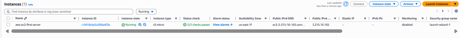
12. To connect to the server, copy the Public IP Address of the instance.
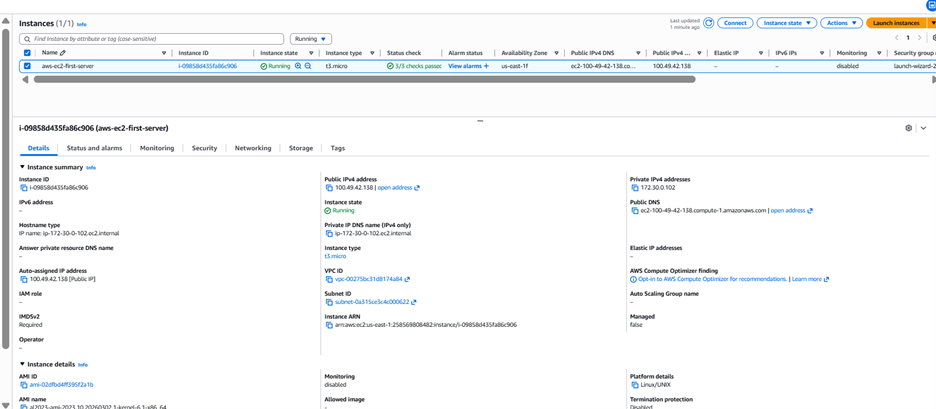
13. Open a terminal and run the following command:
    
```bash
ssh -i /path/key-pair-name.pem ec2-user@instance-public-dns-name
```
This command will allow you to connect to the EC2 instance via SSH.

## Important: Security Note
Before connecting via SSH, ensure your private key file has the correct restrictive permissions. Linux and macOS users must run the following command, otherwise, the connection will be rejected for being "too open":
```bash
chmod 400 your-key-name.pem
```
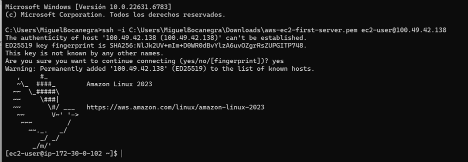

14. Once connected to the server, you can test the connection by updating the system packages:sudo yum update -y
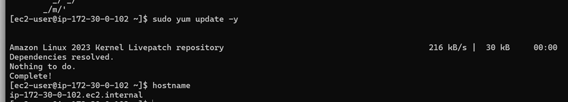

## Core commands

## Connect to the Server

```bash
ssh -i mykey.pem ec2-user@YOUR_PUBLIC_IP
```
## Operating system update

```bash
sudo yum update -y
```
## Skills Demonstrated

- AWS EC2 provisioning
- Security Group configuration
- SSH authentication
- Linux server administration
- Cloud infrastructure fundamentals

## What I Learned

* How to create a virtual machine in AWS
* How SSH authentication works
* Basic Linux server management
* Cloud infrastructure fundamentals

## Future Improvements

* Install a web server (Nginx or Apache)
* Automate instance creation using AWS CLI
* Add monitoring with CloudWatch

## Project Structure
```bash
aws-ec2-first-server
│
├── README.md
└── ec2-images
    ├── infra.png
    ├── step1.png
    ├── step2.png
    ├── step3.png
    ├── step4.png
    ├── step5.png
    ├── step6.png
    ├── step7.png
    ├── step8.png
    ├── step9.png
    ├── step10.png
    ├── step11.png
    ├── step12.png
    ├── step13.png
    └── step14.png
```

## Author

Miguel Bocanegra
